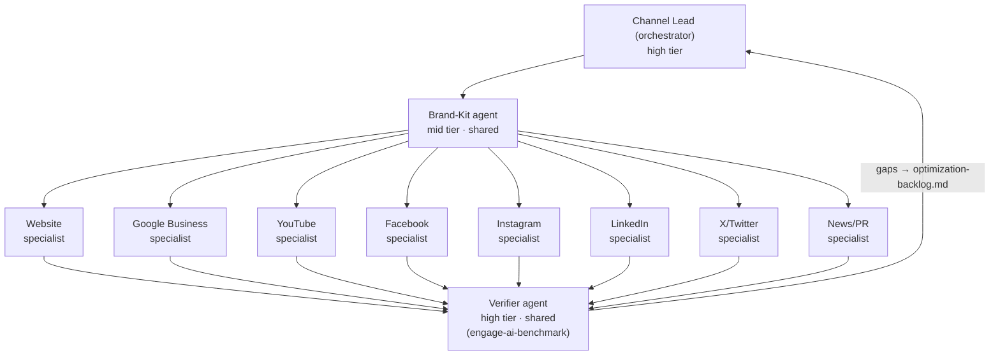
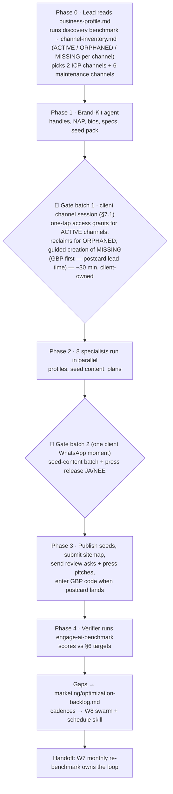

# Engage AI Channel Onboarding — Specialized Agent Team (Plan)

**Goal:** A specialized agent team that takes an approved brand (`business-profile.md`) and establishes it on **all 8 Engage AI channels** — Website, Google Business, Facebook, Instagram, YouTube, LinkedIn, X/Twitter, News mentions — with every onboarding step engineered against the exact levers of the Engage AI scoring rubric, so the brand's baseline benchmark is earned, not accidental.

**Created:** 2026-07-20 · Extends [onboarding-plan.md](onboarding-plan.md) W7/W8 and adopts the actor model from [gate-minimization/gate-minimization.md](gate-minimization/gate-minimization.md).

---

## 1. Why a channel team, and how it fits W7/W8

The org score is a **plain average of all 8 channel scores, and a missing channel counts as 0** — so an absent channel drags the whole org score down. Yet W8 correctly says: sustain content on only the 2 ICP-matched channels. These reconcile as two tiers:

| Tier | Channels | What it means | Owned by |
|---|---|---|---|
| **Presence tier** | all 8 | Channel exists, profile 100% complete, seeded with first content, `found=true` for the benchmark | **This team** (one-time onboarding) |
| **Growth tier** | the 2 ICP channels | Sustained cadence, engagement work, follower growth | W8 social swarm (ongoing) |

Just existing is the cheapest scoring lever in the entire rubric: `found=true` alone is worth 20 pts on every social channel, 30 on Google Business, 25 on the website (`indexed=true`). Onboarding all 8 channels converts "0 across the board" into a floor of ~20–30 per channel before any growth work begins. The remaining channels then run a **maintenance cadence** (e.g. monthly cross-post) so they never decay to `posting_frequency=none`.

**Relationship to the W7 loop:** this team is the "channel doesn't exist yet" branch of the Engage AI optimization loop. W7 benchmarks and prioritizes; when a channel is `white_space` (score 0), the fix routes here; when it exists but underperforms, the fix routes to W8/W4 as before.

**The frame (governs every design choice below):** the actor at the center is **a client onboarding *their* brand or business** — a non-technical organization per the gate-minimization client model (phone + WhatsApp, no dashboards, no new passwords where avoidable). Three consequences:

1. **Channels are client-owned from day one.** VOM operates them via partner/manager access, never via custody of the client's logins. (This is also Meta's own stated best practice: client owns the Business Portfolio, agency attaches as partner.)
2. **The client probably already has channels.** A church or SME typically arrives with an existing Facebook page, a Google listing someone once made, maybe a YouTube channel with lost credentials. Onboarding starts with **discovery and claim**, not greenfield creation.
3. **"Account creation is human" resolves to *the client's* hands**, guided — not to a VOM back-office sitting. §7.1 defines how.

---

## 2. Team design

Modeled on the devops-scrum-orchestrator pattern (cheapest-capable model per role, escalate one tier on validation failure). One lead, two shared specialists, eight channel specialists.

**C1 · Team structure:**

### Roster

| Role | Agent file | Model tier | Responsibility |
|---|---|---|---|
| **Channel Lead** | `biz-channel-lead.md` | high | Reads `business-profile.md`; decides ICP vs maintenance channels; dispatches specialists in parallel; **consolidates all human gates into batched scripts** (one guided client channel session per §7.1, one client WhatsApp approval digest — never 8 separate interruptions); runs discovery → `marketing/channel-inventory.md`; generates `marketing/account-creation-cockpit.html`; tracks `marketing/channel-onboarding-status.md` |
| **Brand-Kit agent** | `biz-brand-kit.md` | mid | The shared input every specialist consumes (§3): handle availability sweep, bios, avatar/banner specs per platform, canonical NAP, link strategy |
| **Website specialist** | `biz-ch-website.md` | mid | Indexing, freshness, and backlink levers (§4.1) |
| **Google Business specialist** | `biz-ch-gbp.md` | mid | Profile completeness, verification flow, review engine (§4.2) |
| **YouTube specialist** | `biz-ch-youtube.md` | mid | Channel setup, first-5-videos plan, cadence (§4.3) |
| **Facebook / Instagram / LinkedIn / X specialists** | `biz-ch-facebook.md`, `biz-ch-instagram.md`, `biz-ch-linkedin.md`, `biz-ch-x.md` | low (escalate to mid) | Identical scoring rubric, platform-specific execution (§4.4) |
| **News/PR specialist** | `biz-ch-news.md` | mid | Press release, media list, launch pickup (§4.5) |
| **Verifier** | `biz-ch-verifier.md` | high | Runs `engage-ai-benchmark` after onboarding; scores vs the Definition-of-Done targets (§6); files every gap into `marketing/optimization-backlog.md`; schedules the monthly re-benchmark |

Per-channel instances are cheap and parallel; the Lead, Brand-Kit and Verifier are singletons per run.

---

## 3. Shared input: the brand kit

Produced once by the Brand-Kit agent before any specialist starts, saved to `marketing/brand-kit.md`. Prevents the classic failure mode: 8 agents inventing 8 slightly different bios, handles, and phone numbers (NAP inconsistency also directly hurts Google Business).

| Brand-kit element | Notes |
|---|---|
| **Handle matrix** | One target handle checked for availability on all platforms simultaneously; fallback pattern (`@brandnl`, `@brand_hq`) decided once, not per platform |
| **Canonical NAP** | Name, address, phone — byte-identical everywhere (GBP, directories, site footer, socials) |
| **Bio set** | 160-char, 80-char, and one-liner variants in the brand's tone-of-voice; each ends with the same CTA link |
| **Visual specs** | Avatar (square, min 400px), banner per platform dimension, 3 template frames for posts — specs + prompts only; production via existing design tooling |
| **Link strategy** | Every channel links to the site with `?utm_source=<channel>` so the Analyst can attribute traffic; site links back to every channel (also feeds the `backlink_signal` lever) |
| **Seed content pack** | 10 launch posts + 1 announcement, written once, adapted per platform by each specialist — not rewritten from scratch |

---

## 4. Per-channel playbooks

Each playbook lists the **rubric levers** (what the benchmark actually measures), the onboarding steps with their **actor class** (PLATFORM-AUTO / VOM-ONCE / VOM-RECURRING / CLIENT-PHONE, per gate-minimization), and a **Definition of Done**. Steps marked ◆ directly move a scored field.

### 4.1 Website (`biz-ch-website`)

**Levers:** `indexed` (25) · `pages_indexed_estimate` (5–19 pages → 10) · `backlink_signal` (low → 8) · `freshness` (occasional → 8, active → 17)

| Step | Actor | Detail |
|---|---|---|
| ◆ Sitemap + robots.txt + schema.org | PLATFORM-AUTO | Ship with the W4 build; JSON-LD `Organization` with the canonical NAP |
| ◆ Search Console property + sitemap submit | VOM-ONCE per Google account, then PLATFORM-AUTO | Fastest path to `indexed=true`; API-verifiable |
| ◆ Reach ≥5 indexable pages | PLATFORM-AUTO | Home, offer, about, contact + 1–2 pillar articles from the seed pack — crosses the first `pages_indexed` tier |
| ◆ Backlink starters | PLATFORM-AUTO prep / VOM-RECURRING accounts | The W7 directory listings + the 7 other channel profiles all linking home = `backlink_signal: low` without outreach |
| ◆ Freshness plan | PLATFORM-AUTO | 2 posts/month routed through W4 pipeline → `freshness: occasional` minimum, `active` when W8 repurposes content |

**DoD:** `indexed=true`, ≥5 pages live, all 7 sister channels linking in, freshness routine scheduled. → **Output:** section in `marketing/channel-onboarding-status.md`

### 4.2 Google Business (`biz-ch-gbp`)

**Levers:** `found` (30!) · `rating` (up to 40) · `review_count` (5–24 → 10)

The single biggest `found` bonus in the rubric, and the only channel with a physical-mail gate — **start it first**, the postcard's 5–14 day lead time is the critical path of the whole run.

| Step | Actor | Detail |
|---|---|---|
| ◆ Profile claim-or-create, category, description, photos, hours, NAP | CLIENT-PHONE (channel session, §7.1) / PLATFORM-AUTO prep | Under the **client's** Google account — claim the existing listing if one exists (ORPHANED case is common); agent delivers every field's exact value; VOM invited as manager via the agency org account |
| ◆ Verification | CLIENT-PHONE | Postcard/phone code → client enters 6 digits via WhatsApp magic-link (existing gate-minimization flow); 48h no-response → VOM call |
| ◆ Review engine | PLATFORM-AUTO drafts / CLIENT-PHONE sends | Review-request template into the W12 post-delivery SOP + a WhatsApp-forwardable ask for the first 5 happy contacts — crossing `review_count ≥5` is worth 10 pts and activates the `rating` lever (5 five-star reviews = full 40) |
| First Google Post + Q&A seeded | PLATFORM-AUTO prep | Launch announcement from the seed pack |

**DoD:** verified profile live (`found=true`), review engine wired into W12, first-5-reviews ask sent.

### 4.3 YouTube (`biz-ch-youtube`)

**Levers:** `found` (20) · `video_count` (≥5 → 5, ≥20 → 10) · `posting_frequency` (monthly → 10, weekly → 20) · `subscriber_count` (≥100 → 10)

| Step | Actor | Detail |
|---|---|---|
| Brand-Account channel under the **client's** Google account (or access grant if one exists) | CLIENT-PHONE (channel session, §7.1) | ~5 min with brand-kit values; VOM invited with channel Manager role |
| ◆ First 5 videos | PLATFORM-AUTO plan / CLIENT-PHONE sign-off | Lowest-effort formats that still count: 1 brand trailer + 4 shorts/screen-recordings repurposed from the seed pack; crossing `video_count ≥5` immediately |
| ◆ Cadence | PLATFORM-AUTO | Monthly minimum (maintenance tier) = 10 pts; weekly only if YouTube is an ICP channel |
| Channel SEO | PLATFORM-AUTO | Titles, descriptions with UTM link, channel keywords, uploads playlist |

**DoD:** channel live with ≥5 videos, monthly slot in the content calendar.

### 4.4 Facebook · Instagram · LinkedIn · X (four specialists, one rubric)

**Levers (identical per platform):** `found` (20) · `follower_count` (≥100 → 10) · `posting_frequency` (weekly → 20, monthly → 10) · `engagement_level` (low → 5, medium → 12)

| Step | Actor | Detail |
|---|---|---|
| Access grant, reclaim, or creation | CLIENT-PHONE (channel session, §7.1) | ACTIVE → one-tap partner/admin grant; ORPHANED → guided reclaim (existing followers carry rubric points); MISSING → client creates in the session: FB Page + LinkedIn Company Page under their own profiles, IG spawned from the FB Page, X = the one truly new login |
| ◆ 100% profile completion | PLATFORM-AUTO prep | Bio, avatar, banner, link-with-UTM, location — from the brand kit, zero per-platform improvisation |
| ◆ Seed content | CLIENT-PHONE (batch approval) | First 10 posts adapted from the seed pack, staggered over 2 weeks so the profile looks alive, not bulk-dumped |
| ◆ First-100-followers plan | PLATFORM-AUTO plan / CLIENT-PHONE execute | Warm network invite list + cross-promotion from existing VOM/org channels + follow-worthy niche accounts list; crossing 100 followers = first tier on every platform |
| ◆ Cadence handoff | PLATFORM-AUTO | ICP channels → W8 swarm weekly cadence (20 pts); the rest → monthly maintenance cross-post (10 pts, keeps `posting_frequency` off `none`); publishing autonomy governed by the §7.2 mandate tier |

**DoD per platform:** live, 100% complete profile, ≥10 posts queued and approved, follower plan executing, cadence owner assigned (W8 or maintenance).

### 4.5 News mentions (`biz-ch-news`)

**Levers:** `found` (20) · `mention_count_recent` (1–4 → 20) · `most_recent_mention_recency` (within_month → 40!)

The highest points-per-effort channel in the rubric: **one** local/niche pickup within the launch month scores 80/100. Also inherently recurring — recency decays, so this specialist leaves behind a quarterly PR rhythm, not a one-off.

| Step | Actor | Detail |
|---|---|---|
| ◆ Launch press release | PLATFORM-AUTO draft / CLIENT-PHONE sign-off | Newsworthy angle (launch, founder story, local relevance), quote, boilerplate, press photo from brand kit |
| ◆ Media list | PLATFORM-AUTO | 15–25 targets: local outlets, niche/vertical media (church-media press for CMA-type brands), NL startup/SME press, relevant newsletters and podcasts |
| ◆ Distribution | CLIENT-PHONE / VOM-RECURRING | Pitches drafted per outlet; sending is gated like W9 outreach — never auto-sent |
| ◆ Recency rhythm | PLATFORM-AUTO | Quarterly newsworthy-moment calendar (milestone, partnership, data/report release — an `engage-ai-scan` industry mini-report is itself a PR asset) keeping `most_recent_mention_recency` inside `within_quarter` |

**DoD:** release approved, ≥15 pitches sent, quarterly PR calendar scheduled.

---

## 5. Run pipeline

**C2 · Channel onboarding flow:**

**Sequencing rules:**
1. **GBP claim-or-create always first** — its postcard is the only multi-day external dependency; everything else fits inside its shadow.
2. **Gates are batched, never scattered:** exactly two gate moments per run — the client channel session (gate batch 1: grants + reclaims + guided creation, §7.1) and one client WhatsApp approval digest (gate batch 2). GBP code entry is a third, externally-timed micro-moment.
3. Specialists run fully parallel in Phase 2; none depends on another (the brand kit removed all cross-talk).
4. A specialist that can't reach its DoD escalates one model tier, then to the Lead — same rule as the scrum plugin.

---

## 6. Score targets (Definition of Done, quantified)

Projected from the rubric, assuming steps land. Day-0 = accounts live + seeds published; Day-30 = first cadence cycle + review/press asks landed.

| Channel | Day-0 | Day-30 target | Day-30 composition |
|---|---|---|---|
| Website | 25 | **~51** | indexed 25 + 5–19 pages 10 + backlinks low 8 + freshness occasional 8 |
| Google Business | 30 | **~60–80** | found 30 + 5 reviews 10 + rating lever activated (5×5★ → +40) |
| YouTube | 20 | **~35** | found 20 + 5 videos 5 + monthly 10 |
| Facebook | 20 | **~45–55** | found 20 + 100 followers 10 + cadence 10–20 + engagement low 5 |
| Instagram | 20 | **~45–55** | same composition |
| LinkedIn | 20 | **~45–55** | same composition |
| X/Twitter | 20 | **~45–55** | same composition |
| News | 0–20 | **~80 (if 1 pickup)** / 20 floor | found 20 + 1–4 mentions 20 + within_month 40 |
| **Org score** | **~19–22** | **~50–57** | vs ~0 without this team |

The Verifier treats Day-30 targets as the pass bar: any channel below target gets a gap entry with the specific missing lever (e.g. "GBP review_count=2, need 3 more → W12 review engine check").

---

## 7. Consolidated gate schedule (whole 8-channel run)

| Gate | Actor | When | Time |
|---|---|---|---|
| Client channel session: grants + reclaims + guided creation | CLIENT-PHONE, VOM co-drives (§7.1) | Gate batch 1, day 1 | ~30 min client + ~30 min VOM |
| One-tap access grants for ACTIVE channels | CLIENT-PHONE | In/around the session | ~1 min each |
| Agency structures: Meta Business Portfolio, GBP org account, vault | VOM-ONCE | Before first client, inherited after | ~30 min ever |
| Search Console first-time auth | VOM-ONCE | Gate batch 1 (first brand only, inherited after) | ~5 min ever |
| Seed content + press release approval | CLIENT-PHONE | Gate batch 2 | ~5 min |
| GBP verification code | CLIENT-PHONE | Postcard arrival (day 5–14) | ~1 min |
| Press pitch / review-ask sending | CLIENT-PHONE or VOM-RECURRING | Phase 3 | ~3 min |
| Ongoing: batch publish + outreach digests | CLIENT-PHONE | weekly, owned by W8 (approve-before at M0; review-after at M1/M2) | existing gate |
| Growth-mandate grant / tier upgrades (§7.2) | CLIENT-PHONE | M1 offered after ≥2 clean digests; M2 after a month of M1 | ~3 min per grant |

Total new human cost per brand: **one ~30-min guided client channel session (VOM co-driving) + ~10 min client across the other phone moments.** The session is the single intensive client moment of the whole onboarding — explicitly framed as "the setup call", outside the ≤5-min-per-approval budget that governs every other gate. The final click on any account creation stays with a human — specifically the **client**, on their own devices — per platform ToS and the ownership frame; §7.1 shows how discovery, one-tap grants, and the cockpit engineer away nearly everything around that click.

### 7.1 Facilitating the account-creation gate (the main pain point)

The frame from §1 dissolves most of this gate: **the client is onboarding *their* brand, and they arrive with logins, channels, and a phone already in hand.** The team's job is not to create six accounts in a back office — it is to *discover what the client already has, get granted access to it, and guide the client through creating only what's genuinely missing, on their own devices, under their own identity.* Four mechanisms:

#### Mechanism 1 — Discovery before creation (PLATFORM-AUTO)

The baseline `engage-ai-benchmark` run doubles as the **channel inventory**: it already answers `found=true/false` per channel. The Lead extends it into a per-channel classification in `marketing/channel-inventory.md`:

| State | Meaning | Route |
|---|---|---|
| **ACTIVE** | Channel exists, client has working access | → access grant (Mechanism 2), then straight to profile-completion in §4 |
| **ORPHANED** | Channel exists, access lost (the old volunteer's Facebook page, the forgotten Google listing) | → reclaim runbook (Mechanism 2) |
| **MISSING** | No presence | → guided creation (Mechanism 3) |

For a typical church/SME client, 2–4 of the 8 channels already exist. Every existing channel is onboarding work that **disappears** — creation was never needed, only access.

#### Mechanism 2 — Access grants and reclaims, one tap each (CLIENT-PHONE)

Every major platform has an agency-access flow designed for exactly this, and each is a **one-tap approval on the client's phone** — no credentials shared, no new passwords, fully inside the gate-minimization client model:

| Platform | Grant mechanism | Client effort |
|---|---|---|
| Facebook + Instagram | Meta Business Portfolio **partner request** (client's portfolio stays owner; VOM attaches as partner with per-asset permissions) | tap "Approve" |
| Google Business | **Manager invite** from the profile to VOM's agency org account | tap invite in email |
| YouTube | Channel **permissions invite** (Editor/Manager role) | tap invite |
| LinkedIn | Company Page **admin grant** | tap "Approve" |
| X | Password-manager-mediated shared access or delegate access | one guided moment |

For **ORPHANED** channels the agent preps the platform's reclaim runbook (Google Business "claim this business", Meta page-ownership recovery, YouTube account recovery) with every form value pre-filled; VOM co-drives the recovery with the client on a short call. Reclaiming a half-dead page with existing followers usually beats creating a fresh one — history and followers carry rubric points (`follower_count`, review history).

#### Mechanism 3 — The guided channel session for MISSING channels (CLIENT-PHONE, one scheduled moment)

What's genuinely missing gets created **by the client, on the client's phone, under the client's everyday logins** — one scheduled, VOM-guided WhatsApp (video) session of ~30 min, replacing the old idea of a VOM solo sitting:

- **The client's existing logins do the heavy lifting.** Their personal Google account hosts the Google Business profile *and* a YouTube Brand-Account channel (no new Gmail — up to ~100 brand channels per account). Their personal Facebook profile creates the brand Page, which spawns the linked Instagram professional account. LinkedIn Company Page hangs off whoever's personal LinkedIn profile. Only **X** requires a truly new login.
- **The cockpit feeds the session.** The Lead generates `marketing/account-creation-cockpit.html` — per platform: deep link to the exact creation form, every field value as a copy-ready WhatsApp message (handle, bio, canonical NAP, category, UTM link), avatar/banner files sent as WhatsApp attachments. During the session the agent watches the alias inbox and surfaces email verification codes live; SMS codes arrive on the client's own phone — where they belong.
- **The client-facing form of the cockpit is the channel wizard** — a prototype exists: [channel-wizards.html](channel-wizards.html) (published artifact). One phone-first guided flow per channel in the magic-link screen family: opens with the "Wat wij nooit zien of vragen" privacy card, then per channel a JA/NEE branch (exists → one-tap access-grant steps; missing → creation steps under the client's own logins), copy-button brand-kit values, deep links, privacy notes exactly at the credential/SMS steps, NL/EN, progress saved on the client's phone. The Lead generates a per-brand instance from the brand kit; served as a magic-link screen (T8) so the client can also do channels self-paced outside the live session.
- **VOM co-drives, the client clicks.** The human performing account creation is the brand's own representative — the cleanest possible ToS position — and every asset is client-owned from its first second. VOM's access is granted per Mechanism 2 immediately after each creation, in the same session.

**Custodial fallback (exception, not default):** for a client who genuinely cannot do a guided session, VOM creates missing assets under its agency structures with a contractual transfer clause — same construction as the domain transfer-out policy. This is the documented exception path; the service agreement decides it once, not per brand.

#### Privacy borders of the guided session

Guiding a client through *their own* accounts is exactly where a well-meaning helper oversteps. These rules are hard borders, read to the client in plain language at the start of every session ("Wat wij nooit zien of vragen"), so the border itself builds trust:

1. **Guide by instruction, never by observation.** Default mode is voice + WhatsApp text: VOM says what to tap, the client's screen stays theirs. No screen sharing by default. If the client is stuck, escalation is *"vertel me wat je ziet"* (describe your screen), not "show me your screen." Screen sharing only on the client's explicit offer — and even then VOM says *"typ nu je wachtwoord, ik kijk even weg"* and the client confirms before continuing. Never during password or 2FA entry.
2. **Credentials are never seen, spoken, typed, or stored by VOM or agents.** If a client volunteers a password ("makkelijker als jij het even doet"), VOM declines, explains why in one sentence ("dan blijft het echt van jou"), and the decline is the trust-building moment. The only credential exception is the X login generated *into the client's own vault entry* during the session — and even that is typed by the client.
3. **Two kinds of codes, opposite rules.** *Business verification* codes (the GBP postcard, a domain-verification string) are shareable — they prove the org, not the person. *Authentication* codes (SMS login codes, 2FA, recovery codes) **never leave the client's phone** — VOM never asks for them, not even mid-session with the client's blessing. If a code is needed, the client enters it themselves, on their device.
4. **Personal accounts are anchors, not assets.** The client's personal Google account and Facebook profile *anchor* the brand assets, but VOM's access is granted **per-asset only** (Page, channel, listing, portfolio partner role) — never admin on, login to, or recovery involvement with the personal account itself. The only thing recorded about a personal account is which platform anchors which brand asset — never the personal email address's contents, contacts, or history.
5. **Agents watch only what was built for them.** The live inbox the agent monitors during the session is the **per-brand alias inbox** created for this purpose. Agents never connect to, read, or search the client's personal mailbox, photos, contacts, or message history — and no computer-use/remote-control ever touches a client device.
6. **Data minimization in the cockpit.** Cockpit values are business data only (brand name, NAP, bios, links). Where a platform demands personal data during signup (birth date, personal phone), the client enters it directly on their device; it is never collected into the cockpit, the brand kit, or any VOM system.
7. **No recording; outcomes only.** Sessions are not recorded. What gets logged is the *result* — which assets were created/claimed and which access grants were made — as consent-log rows, in the same append-only log as every other approval.
8. **GDPR posture:** VOM processes only business-contact data, the consent log, and granted-asset metadata; the processor role and this border list are part of the plain-language terms the client already approves at Step 1/8 — so the privacy promise is itself consented, not implied.

#### Mechanism 4 — Standing structures that make every next client cheaper (VOM-ONCE)

- **Meta Business Portfolio** (VOM as partner org), **Google Business agency/org account**, **LinkedIn page-admin identity** — set up once, then every client grant is one tap into an existing structure.
- **Password vault** (1Password/Bitwarden): for the rare shared credential (X), generated into a per-client vault during the session; never in chat, email, or agent context. Vault sharing is also the exit/handover mechanism.
- **Per-brand email aliases** (Brevo/one.com) pre-created before any session so verification mails land where the agent can watch them.

#### Revised gate shape

| | Old picture | Client-frame picture |
|---|---|---|
| Who clicks "create" | VOM, 6× in a back-office sitting | Client, only for MISSING channels, guided |
| Typical creations needed | 6 | **1–4** (discovery removes the rest) |
| Client time | ~10 min scattered | one ~30-min guided session + a few one-tap grants |
| VOM time | ~90 min solo | ~30 min co-driving + reclaim assists |
| Ownership at day 0 | VOM custody, transfer later | **client-owned from first second** |

The ~30-min session is deliberately **one** scheduled moment — it exceeds the per-approval ≤5-min rule of the client-ux model, so it is framed to the client as the single "setup call" of the whole onboarding, not as one of the routine WhatsApp approvals. Everything else in this plan stays within the existing approval budget.

#### What deliberately stays out

- **No browser automation of signup forms** (agent-driven form-filling on account creation violates the platform ToS this section exists to respect; CAPTCHAs would break it anyway).
- **No API asset creation** where the API is partner-gated (Meta/LinkedIn page creation; no YouTube channel-creation API exists). If VOM later qualifies for a partner program, individual rows can upgrade.
- **No credential custody by default** — access grants over shared passwords, everywhere a platform offers them.
- **No VoIP/number-pool tricks** for SMS verification — the client's own phone is both cleaner and ownership-correct.

### 7.2 The growth mandate — the client authorizes agents to drive channel growth

The §7.1 access grants are the **technical** authorization (agents *can* post via the granted partner roles and official APIs). The **growth mandate** is the *consent* authorization: the client explicitly empowers VOM's agents to grow their channels within defined boundaries — captured, scoped, and revocable. This is the deliberate, opt-in upgrade path from the current default ("nothing ever auto-posts, every batch approved") to earned autonomy.

#### Mandate tiers (per client, upgradeable per channel)

| Tier | Name | Agents act without asking | Still asked per item |
|---|---|---|---|
| **M0** | Draft-only *(default at onboarding)* | drafts, plans, scheduling proposals | every post — weekly digest JA/NEE (current W8 model) |
| **M1** | Framework autonomy | publish on **maintenance channels** within the approved content framework (pillars, tone, cadence caps); site freshness updates; review asks per W12 SOP | ICP-channel batches, new campaign themes, anything outside the framework |
| **M2** | Growth autonomy | all of M1 + ICP-channel publishing, cross-posting, replies from an approved FAQ bank, press pitches to the pre-approved media list | everything on the always-human list below |

**Always human, at every tier — no mandate can waive these:** any paid spend (ads, boosts); replies touching complaints, legal, press, money, or pastoral/sensitive matters; deleting published content; account/security settings; DMs beyond the templated FAQ bank; new channel creation. These align with the security.md decision set (blast-radius cap, second factor for high-stakes actions).

#### How the mandate is granted and governed

- **Grant = one WhatsApp magic-link moment**, same pattern as every other approval: the mandate scope rendered in plain language ("what the agents will do without asking, what they will always ask, how you stop it"), JA/NEE, consent-logged. Scope lives in `marketing/growth-mandate.md`; every grant, upgrade, downgrade, and revocation is a consent-log row.
- **Earned, not assumed:** every client starts at M0. Upgrade to M1 is offered after ≥2 clean weekly digests (client approved without edits); M2 after a month of M1 with benchmark evidence in hand ("here's what we published and what it did — want us to keep going without the weekly wait?").
- **Revocation is instant and asymmetric:** one WhatsApp message ("stop") drops the client to M0 immediately; upgrades always require the explicit magic-link YES. The weekly digest never disappears — at M1/M2 it flips from *approve-before* to *review-after* (what was published + performance), so the client always sees everything.
- **Automatic downgrade triggers:** negative-sentiment spike in comments, a platform warning/strike, a press or legal inquiry, or any guardrail breach auto-pauses publishing to M0 pending VOM review — the agent equivalent of pulling over.
- **Numeric guardrails in the mandate file:** cadence caps per channel (e.g. ≤5 posts/week/channel), a daily cross-channel blast cap (mirroring the security.md blast-radius decision), quiet hours, and the approved pillar/topic list. The Verifier's monthly benchmark is the mandate's report card.

#### What "driving growth" means technically (and what it never means)

Agents grow channels **only through official platform rails**: content published via the granted roles (Meta Graph API/Business Suite scheduling, YouTube Data API, LinkedIn Page API, X API), SEO/freshness work through the W4 pipeline, review-ask sequences via W12, PR via the W9-gated sending flow. **Never**: follow/unfollow churn, auto-likes, engagement pods, auto-DMs to strangers, or any engagement-bot tactic — those violate the same ToS this plan respects and are the fastest way to lose a client's channel. Growth = better content, more consistently, measured by the rubric — not synthetic engagement.

#### Fit with the existing model

This section **amends the W8 rule** "nothing is ever auto-posted" to: *nothing is ever auto-posted **without a standing, scoped, revocable client mandate** — and the default remains M0 approve-first.* The gate-minimization client promise ("nothing without your YES") is preserved: the mandate *is* the YES, given once, in plain language, always reversible, with everything visible in the weekly review digest.

All mandate messages (grants, digests, downgrade notices) travel in **register 2** of the communication doctrine (client-ux.md): sterile, template-fixed, visibly from the service number. Anything relational around the mandate — offering the M1 upgrade, discussing a downgrade — is a **register 1** moment: the operator personally, by call or voice note.

---

## 8. Build plan

### Files to create

| File | Content |
|---|---|
| `.claude/agents/biz-channel-lead.md` | Orchestrator role: inputs (`business-profile.md`, `brand-kit.md`), dispatch order, gate-batching protocol, status-file format |
| `.claude/agents/biz-brand-kit.md` | Brand-kit production spec (§3 as its DoD) |
| `.claude/agents/biz-ch-website.md` … `biz-ch-news.md` (8 files) | Each: rubric levers **pasted verbatim from the scoring rubric** (agents only see their prompt — same rule the benchmark skill already follows), steps, actor classes, DoD, output format |
| `.claude/agents/biz-ch-verifier.md` | Benchmark invocation, §6 pass bars, gap-entry format, schedule-skill handoff |
| `/onboard-channels <business-folder>` skill | Entry point: validates `business-profile.md` exists, spins the team, resumable via `marketing/channel-onboarding-status.md`; ships the templates for `channel-inventory.md`, `account-creation-cockpit.html`, and `growth-mandate.md` (tier scopes, guardrail defaults, consent-log format per §7.2) |

### Build phases

1. **Phase A — write the 11 agent definitions + the skill** (pure authoring, no gates). Template each `biz-ch-*` from a shared skeleton so the four social specialists differ only in platform specifics.
2. **Phase B — dry run on Church Media Academy** (it already has a live site and a Stripe track record but near-zero social presence — a real white-space case). Validate: brand-kit output quality, gate batch 1 script accuracy, seed-pack platform adaptation.
3. **Phase C — first full run on business #2**, integrated with the platform-tenancy flow (Phase 1 of the gate-minimization rollout). Measure actual VOM minutes and client minutes vs §7 estimates.
4. **Phase D — wire into the W7 loop**: the Lead becomes the standing handler for any `white_space` channel the monthly re-benchmark finds, not just launch-time onboarding.

### Exit criteria (per brand)

- [ ] All 8 channels `found=true` / `indexed=true` in a real `engage-ai-benchmark` run
- [ ] Every channel **client-owned** with VOM partner/manager access granted (or documented custodial exception with transfer clause); `channel-inventory.md` shows no unresolved ORPHANED channel
- [ ] Brand kit on file; NAP byte-identical across GBP, directories, site, socials
- [ ] 2 ICP channels handed to W8 with cadence live; 6 maintenance channels on a scheduled monthly touch
- [ ] Growth mandate recorded in `marketing/growth-mandate.md` (M0 at minimum) with consent-log row; M1 upgrade offer scheduled after 2 clean digests
- [ ] Review engine in W12 SOP; quarterly PR calendar scheduled
- [ ] Day-30 verifier run completed, gaps filed in `marketing/optimization-backlog.md`
- [ ] Monthly re-benchmark scheduled — the W7 loop owns the channels from here
