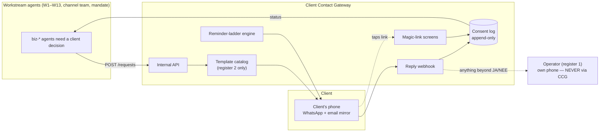

# Client Contact Gateway (CCG) — Component Spec

**What it is:** the single choke point through which every automated client contact flows — approval requests, weekly digests, verification-code entry, mandate grants, reminders — plus the consent log that records what every client actually authorized. It is the **only piece of the onboarding system that is built software** rather than agent behavior: a small multi-tenant service on the existing stack (Vercel + Supabase/Postgres + WhatsApp Cloud API + Brevo mirror).

**Created:** 2026-07-21 · Referenced by [onboarding-plan.md](onboarding-plan.md) (W-cross), [channel-onboarding-plan.md](channel-onboarding-plan.md) §7.1–7.2, and [gate-minimization](gate-minimization/gate-minimization.md) rollout Phase 2. UX contract: [client-ux.md](gate-minimization/client-ux.md) — the 8 steps, pattern language, and **communication doctrine (two registers)** are binding on this spec.

---

## 1. Position in the architecture

**Three invariants, from the doctrine:**
1. **The gateway transmits register 2 only.** No free-form outbound exists in the API — agents can only reference a ratified `template_id` plus variables. There is literally no endpoint for sending arbitrary text to a client.
2. **Anything inbound beyond an expected reply routes to a human.** JA/NEE/digits/voice-note are machine-handled; any other content forwards to the operator's phone with a sterile auto-ack to the client ("We hebben je bericht doorgestuurd naar [operator]. Die reageert persoonlijk.").
3. **Every outbound and every response writes the consent log.** No side channels.

## 2. Operating modes (feasibility-matched rollout)

| Mode | Transport | When | What's automated |
|---|---|---|---|
| **A — Manual** | Operator's WhatsApp Business app, links pasted by hand | Clients #2–3, now | Magic-link screens, consent log, ladder *alerts to operator* ("send reminder to X today") — sending stays human |
| **B — API** | WhatsApp Cloud API (dedicated number, Meta-verified via the §7.1 Business Portfolio) + Brevo email mirror | From gate-minimization Phase 2/3 | Everything: template sends, reminders, webhook reply capture |
| **C — Flows** | Mode B + WhatsApp Flows for in-chat forms | Optional upgrade | GBP code entry, per-post digest approval without leaving the chat — replaces some magic-link screens |

Mode A means the gateway delivers value from day one (screens + consent log) with zero Meta dependencies; templates get ratified against real usage before Mode B automates them. The magic-link screens and consent log are identical across modes — only the transport changes.

## 3. Template catalog (the ratify-once set)

Each template exists in NL + EN, wording per the client-ux.md copy, submitted for Meta approval once (Mode B), category **utility** (transactional wording — never promotional phrasing, which risks reclassification as marketing at ~10× NL cost).

| ID | Purpose | Client-ux source | Reply handling |
|---|---|---|---|
| `T1_profile_terms` | Profile + terms/privacy approval (bundled) | Steps 1+8 | JA/NEE/voice → 2 consent rows |
| `T2_content` | Content sign-off (site copy, products) | Step 3 | JA/NEE/voice |
| `T3_digest` | Weekly digest (posts + outreach; at mandate M1/M2 becomes review-after) | Steps 4+5 | JA-voor-alles / per-item NEE |
| `T4_gbp_code` | GBP postcard expectation-set + code nudge + entry | Step 6 | 6 digits in chat or magic link |
| `T5_oneoff` | Pricing / refund yes-no | Step 7 | JA/NEE in chat, no link |
| `T6_reminder` | 24h gentle reminder (generic wrapper, no new content) | Ladder | — |
| `T7_mandate` | Growth-mandate grant / tier change / downgrade notice | channel-plan §7.2 | JA/NEE; "stop" always honored from any message |
| `T8_session` | Channel-session scheduling + the "Wat wij nooit zien of vragen" privacy card | channel-plan §7.1 | date-pick link |
| `T9_stripe_link` | Stripe-hosted KYC / account-update magic link | Step 2, payments.md | link-only, completion detected via Stripe webhook |
| `T10_statement` | Monthly white-label statement delivery | payments.md §5 | none expected |

Template changes are a **ratification event** (operator approves new wording; consent-log row of type `template-ratified`), never a silent edit — the sterile register's zero-overhead property depends on wording being fixed.

## 4. Data model (Supabase/Postgres, per-tenant isolation by `tenant_id`)

- **`tenants`** — `tenant_id`, org name, client phone(s) allowed to respond, language (nl/en), mandate tier (M0/M1/M2), quiet hours, digest day/time.
- **`requests`** — one row per approval ask: `request_id`, `tenant_id`, `template_id`, `step_type`, `content_ref` (hash/version of the exact content shown), `payload` (rendered values), `status` (sent / reminded / escalated / answered / expired), `expires_at` (default 14d), ladder timestamps.
- **`consent_log`** — append-only, exactly the client-ux.md schema (`event_id`, `step_type`, `content_ref`, `channel`, `sent_at`, `responded_at`, `response`, `responder`, `escalated`) plus mandate events (`mandate-granted`, `mandate-revoked`, `template-ratified`). No deletes, no updates — corrections are new rows.
- **`magic_links`** — single-purpose signed tokens: `token` → (`request_id`, one screen, one decision), expired on decision or 14 days. **No PII in URLs ever** — the token resolves server-side.
- **`templates`** — catalog with ratified wording per language + Meta approval status.

## 5. Internal API surface (token-authed, agents + skills only)

| Endpoint | Used by | Behavior |
|---|---|---|
| `POST /requests` | any workstream agent | Create an ask: tenant, template_id, step_type, content payload, ladder profile. Returns request_id. **Digest-eligible asks are queued, not sent** — the digest job bundles them (anti-"phone as work queue" rule). |
| `GET /requests/:id` | the asking agent | Status + response; agents poll or subscribe. A pending ask = that workstream's dependent steps stay paused (the D1 gate protocol, unchanged). |
| `POST /webhooks/whatsapp` | Meta Cloud API | Verify signature → parse JA/NEE/digits/voice → match to open request (by responder phone + recency) → write consent row → ambiguous/foreign content → forward to operator (invariant 2). |
| `POST /webhooks/stripe` | Stripe | Marks T9 flows complete (`requirements.currently_due` empty). |
| `GET /a/:token` | client's browser | Renders the magic-link screen (inline content, big JA/NEE, read-aloud, 20px+ font per client-ux). Decision POSTs back, expires token, writes consent row. |
| cron `ladder` | scheduler | T+24h reminder (T6), T+48h operator-call alert; GBP requests use the delayed clock (ladder starts after the 14-day postcard window). |
| cron `digest` | scheduler | Per tenant, at digest day/time: bundle queued items into one T3 send with one magic link. |

**What the API deliberately lacks:** a free-text send endpoint (invariant 1), a read endpoint for client message history beyond request-matching (data minimization — the gateway is not a CRM; W10 is), any client-auth concept (clients never log in — magic links only, per client-ux anti-patterns).

## 6. Security & privacy posture

- **Tokens:** magic-link tokens signed + single-purpose + auto-expiring; rate-limited; a used token renders "al beantwoord" with the recorded decision, never a re-vote.
- **Responder allow-list:** replies only accepted from phone numbers registered to the tenant; others get the human-forward treatment.
- **Blast-radius cap:** a per-day outbound ceiling per tenant and platform-wide (the security.md N=5 decision applies here too) — a runaway agent cannot spam clients; the gateway refuses, alerts the operator.
- **High-stakes second factor:** T5 refund/pricing above a threshold and T7 mandate *upgrades* can require the OTP/verbal-confirm second factor pending in the security.md decision set.
- **GDPR:** processor role per the Step-8 terms; data = business contact info, consent log, request payloads. Retention: consent log kept (it's the authorization record); message payloads prunable after expiry. Meta processes WhatsApp content — covered via Meta's EU DPA; sensitive content stays on magic-link screens (VOM-hosted) rather than in message bodies, which also keeps it out of Meta's storage.
- **No cold contact:** the gateway refuses sends to any number without a logged opt-in row (`step_type: opt-in`, captured at intake). W9 prospect outreach is architecturally impossible through the CCG — different system, different rules, human-sent.

## 7. Build plan

| Phase | Scope | Delivers |
|---|---|---|
| **B1** | Supabase schema + magic-link screens + consent log + operator ladder alerts | **Mode A live** — usable for the next client with zero Meta dependencies; screens satisfy gate-minimization rollout Phase 2 |
| **B2** | Meta business verification, dedicated number, Cloud API, T1–T10 template approval, reply webhook | **Mode B** — automated sends + captured replies |
| **B3** | Digest cron, GBP delayed ladder, Stripe webhook, statement delivery | Full operating rhythm automated |
| **B4** | WhatsApp Flows (digest per-item approval, GBP code), mandate-tier logic (M1/M2 review-after digests) | Mode C polish + §7.2 mandate fully wired |

Build execution: the **devops-scrum-orchestrator** plugin (same engine as W4 sites) with this spec as the PO input. B1 is deliberately small — schema, ~3 screens, one cron.

## 8. Definition of done

- [ ] Invariants hold by construction: no free-text outbound endpoint exists; unmatched inbound forwards to operator; every send/response has a consent row
- [ ] Mode A runs a real client end-to-end (profile → digest → GBP code) with a complete consent log
- [ ] All 10 templates ratified (operator sign-off logged); Mode B: Meta-approved as utility
- [ ] Ladder verified with a timeout scenario (24h reminder, 48h operator alert, GBP delayed clock)
- [ ] Blast cap + responder allow-list + token expiry tested adversarially
- [ ] Register-1 traffic confirmed absent: the operator's personal number appears nowhere in gateway config
