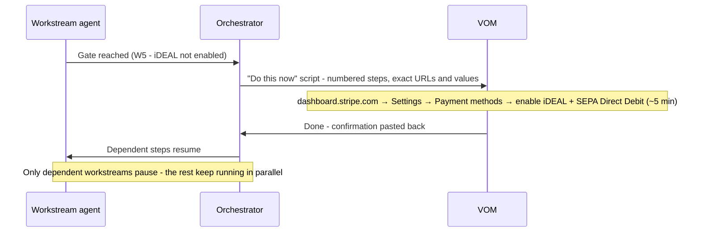
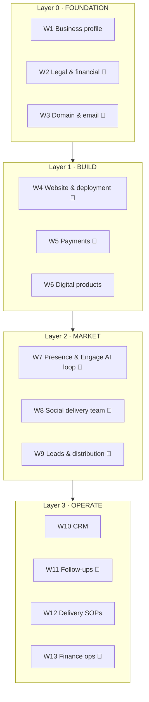
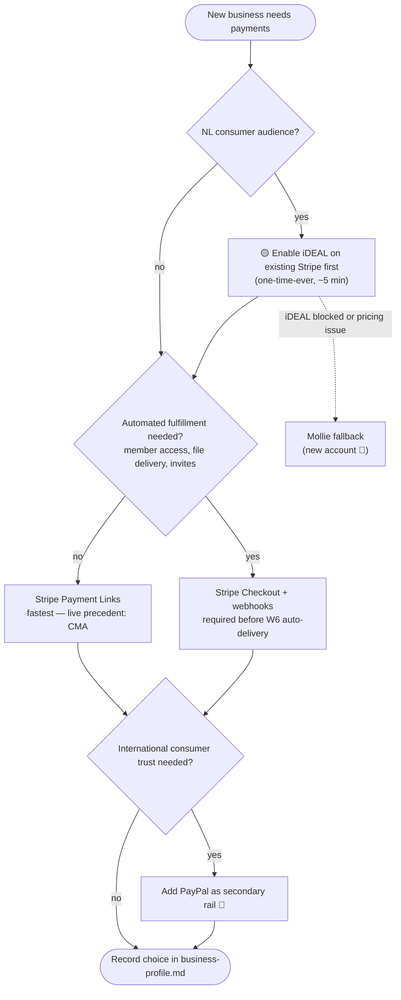
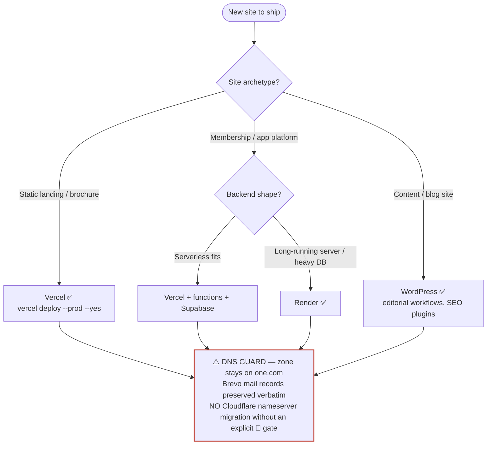
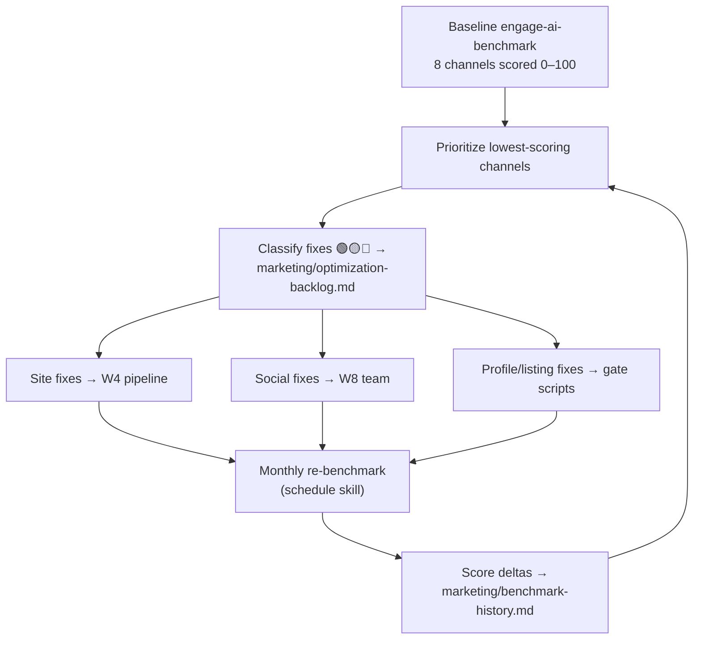
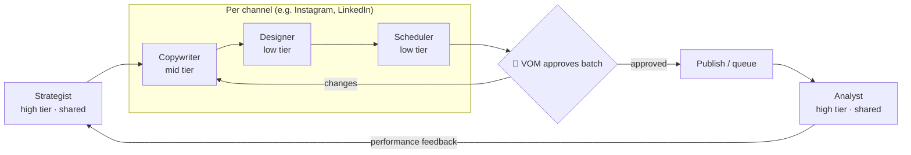
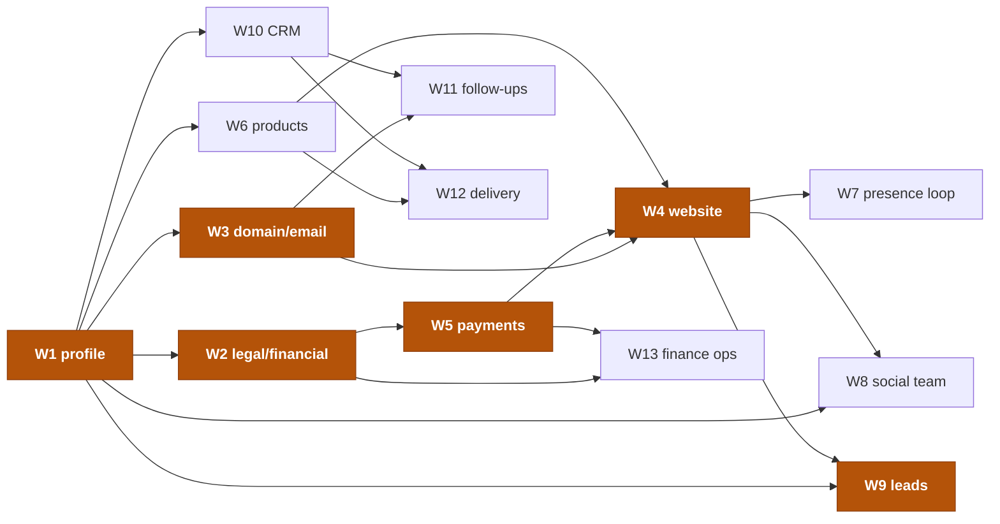

# General Business Onboarding System — Plan & Analysis (v2)

**Goal:** A repeatable, agent-executed workflow that takes any new business idea from initiation to full production — deployed, taking payments, generating leads, and operating — with VOM only performing the steps agents legally/safely cannot (account creation, payments, credentials, signatures).

**Created:** 2026-07-20 · **v2:** 2026-07-20 — added process diagrams (D1–D7), per-workstream prerequisites with automation classes, payment & hosting channel matrices grounded in the live stack, the social-media delivery swarm, and the Engage AI optimization loop.

**Visual overview:** [onboarding-overview.html](onboarding-overview.html) (published as an artifact). This markdown file is the source of truth; the overview page is a render of it. See also the [launch-console.html](launch-console.html) (guided flow) and the gate-minimization docs.

---

## 0. Business model — the product, and why clients stay

Everything below this section is *machinery*. This section is *why it's a business*. Two things the mechanics alone never state: what VOM actually sells, and what keeps a launched business attached when the client owns everything.

### Three layers of "business"

1. **The launcher is the product.** VOM's sellable offer is the done-for-you service itself — *"we launch and run a turnkey business for you."* The two captured offers (the €999 AI assessment, the membership academy) are **examples of what the launcher produces**, not the ceiling of what VOM sells. The highest-leverage business here is the launcher, because it is what all of this architecture actually enables.
2. **VOM's own instance runs operator-run.** VOM builds its own site, payments, and lead-gen through the same workstreams — but as the platform **root**, not as a tenant of its own platform. VOM holds the master credentials (Stripe platform account, Cloudflare zone, provider logins); a tenant is by definition *not* the root, so VOM cannot be its own tenant. VOM's own business therefore uses the **operator-run model** (overview §04, "VOM executes the gates"). Church Media Academy was built this way.
3. **Client businesses run on the tenancy model** (overview §05) — Stripe Connect Express, the delegated `clients.` DNS zone, magic-link phone approvals. This is the machine described in §1–§9 and re-mapped in `gate-minimization/`.

### Ownership ≠ attachment — the retention model

The ratified decisions deliberately give the client **full ownership of the assets**: their domain from day one (D4), their Stripe connected account with funds flowing straight to their own IBAN, their content, their customers. There is **no hostage lever, by design** — and that is a feature, not a leak of value.

Retention comes instead from *operational dependency and recurring value*. Four tethers, none of them lock-in:

1. **Operational dependency** — the client is non-technical by definition and cannot run the hosting, DNS, email, agent automations, social swarm, follow-ups, or monthly optimization themselves. Leaving means the business stops being *operated*.
2. **Recurring revenue is the model** — the business is a retainer / membership back-end (the AI Concierge retainer, the membership tiers), never a one-time launch fee. VOM earns by *running* the business each month.
3. **Platform fee on every transaction** — destination charges carry an `application_fee`, so VOM earns a cut of the client's revenue for as long as the business runs on the platform. A revenue tether that needs no captivity.
4. **Genuine switching cost** — the tuned automations, the per-client running inventory, and the benchmark history all live on the platform; migrating out is real effort, and the automated operation is cheaper than hiring a human to replace it.

**The pitch is sovereignty, not lock-in:** *"we launch and run your business, and it is genuinely yours."* For the faith / church niche especially, trust beats capture — the sovereignty is the selling point.

**The real retention risk** is not that clients walk — it is that if VOM operates *too invisibly*, the client under-perceives the ongoing value and considers taking it in-house or hiring cheaper. **The defense is visible recurring value:** the monthly Engage AI report (W7) and the per-client running inventory (W10) exist precisely to be the monthly proof that justifies the retainer. They are retention infrastructure, not just features.

---

## 1. Operating model

- **One shared input, many agents.** Every business starts with a single `business-profile.md` (offer, niche, pricing, brand, domain, assets). Every agent reads it; no agent asks VOM questions another agent already answered.
- **Agents prepare, VOM approves the gates.** Agents do research, drafts, code, configuration files, and checklists end-to-end. Steps that involve creating accounts, entering credentials, KYC, purchases, or signing anything are **human gates**: the agent delivers an exact "do this now" script (URLs, values to enter, what to copy back), VOM executes in minutes, work continues.
- **Everything lands in the business folder.** Each workstream writes its outputs into the business's folder so state survives across sessions and agents.

**Automation legend** (used throughout this document):

| Class | Meaning |
|---|---|
| 🟢 **AUTO** | Agent obtains/executes it end-to-end, no human touch |
| 🟡 **PREP+GATE** | Agent prepares everything (values, URLs, exact steps); VOM executes a short scripted action |
| 🔴 **HUMAN** | VOM only — credentials, KYC, account creation, signatures, money movement. Never upgradeable to automation |

- **Reuse principle:** many 🔴 gates are one-time-**ever**, not one-time-per-business. Stripe account + KYC, Vercel account, one.com registrar login, Brevo mail, and the KVK entity were cleared while launching business #1 (Church Media Academy). Business #2+ inherits them — the master matrix in §6 tracks `done` vs `pending` so an agent onboarding the next business only surfaces the gates that remain.

**D1 · The human-gate protocol** (concrete example: enabling iDEAL on Stripe):

## 2. The four layers

Workstreams grouped by dependency. A layer can start once its upstream gates are cleared; workstreams inside a layer run in parallel.

**D2 · Layer pipeline** (🔴 marks workstreams containing human gates):

## 3. Channel ground truth & decision matrices

Facts every agent must know before proposing payment or hosting choices. These reflect the **live stack as of 2026-07-20**, proven on business #1 (Church Media Academy).

### 3.1 Payment channels

**Current state:** VOM's Stripe account is **live and KYC'd**, with three production Payment Links on Church Media Academy (founding €29/mo capped at 10, monthly €39/mo, annual €390/yr — all redirecting to `/?paid=1`). Card, Apple Pay, Google Pay, and Link are enabled. **iDEAL is NOT yet enabled** — a named 🟡 action item (Stripe → Settings → Payment methods; SEPA Direct Debit makes iDEAL-initiated subscriptions renew). Mollie and PayPal are not set up.

| | Stripe Payment Links | Stripe Checkout + webhooks | Mollie | PayPal |
|---|---|---|---|---|
| Setup effort | Minutes (live precedent: CMA) | Hours–a day (code + endpoint) | New account + KYC (🔴) | New business account (🔴) |
| iDEAL | ✅ once enabled on the account | ✅ once enabled | ✅ native, NL-first | ◻ via iDEAL rails, clunky |
| Subscriptions | ✅ | ✅ | ✅ | ✅ (weaker tooling) |
| Automated fulfillment | ✕ no webhook flow to your code | ✅ webhooks drive delivery | ✅ webhooks | ◻ IPN, dated |
| Fees (EU ballpark) | ~1.5% + €0.25 EU cards | same | iDEAL ~€0.29 flat | ~2.9% + fixed |
| NL-consumer fit | Good (once iDEAL on) | Good (once iDEAL on) | Excellent | Trust badge for intl. buyers |
| Best for | First euro, fast launch | Anything with automated delivery (W6) | Stripe-iDEAL blocked/pricing issue | Add-on rail, never primary |

**D3 · Payment channel decision tree:**

**Decision rules:**
1. NL consumer/church audience → enable iDEAL on the existing Stripe account **before** launch; it's a one-time toggle, not a new account.
2. Payment Links are the launch default; upgrade to Checkout + webhooks the moment a product needs automated delivery (W6) — Payment Links cannot trigger your fulfillment code.
3. PayPal is only ever an **add-on** checkout option for international consumer trust, never the primary rail.
4. Mollie only enters if Stripe's iDEAL approval or pricing becomes a real blocker — it costs a fresh 🔴 account + KYC.

### 3.2 Delivery / hosting channels

**Current state:** Vercel is the active, proven channel — `church-media-academy` deployed with `vercel deploy --prod --yes`, live at `https://cma.visionoutreachmedia.nl` (custom domain, auto-SSL). The `visionoutreachmedia.nl` DNS zone lives on **one.com nameservers** with Brevo mail records that must be preserved verbatim. **Cloudflare is deliberately NOT in the chain** — a nameserver migration would touch mail/Brevo/site records, so any agent proposal to change nameservers is itself a 🔴 gate. Render and WordPress are known channels from VOM's wider stack (not used in this folder yet).

**Archetype × channel matrix** (✅ recommended · ◻ possible · ✕ avoid):

| Site archetype | Vercel | Render | WordPress | Cloudflare |
|---|---|---|---|---|
| Static landing / brochure | ✅ proven, deploy in seconds | ◻ static sites work, less tooling | ✕ overkill + maintenance | ◻ Pages ok, DNS constraint applies |
| Membership / app platform | ✅ + serverless functions + Supabase | ✅ long-running server + managed DB | ✕ plugin fragility for auth/billing | ✕ not a fit |
| Content / blog site | ◻ SSG if agent-maintained | ◻ | ✅ editorial workflows, themes, SEO plugins | ✕ |
| App with heavy backend | ◻ serverless limits | ✅ persistent processes, cron, DBs | ✕ | ✕ |
| DNS / CDN layer | — | — | — | ⚠️ deferred: zone stays on one.com (Brevo mail) |

**D4 · Hosting decision tree:**

### 3.3 Skill & agent-team inventory

| Capability | Status | Role in this system |
|---|---|---|
| `devops-scrum-orchestrator` (plugin) | ✅ installed, proven (built the CMA site: PO→UX→FE→QA, haiku/sonnet tiered routing + escalation) | W4 build engine; its routing pattern is the template for the W8 social swarm |
| `engage-ai-benchmark` (skill) | ✅ installed | W7 loop: deterministic 0–100 scoring of 8 channels — Website, Google Business, Facebook, Instagram, YouTube, LinkedIn, X, news mentions |
| `engage-ai-scan` (skill) | ✅ installed | W6/W12: monthly per-client engagement reports (retention perk) |
| `schedule` (skill) | ✅ installed | W7 monthly re-benchmark, W11 daily follow-ups, W13 finance calendar |
| Orchestrator `/onboard-business` + `biz-*` subagents | 🔲 proposed (§7) | The workflow runner itself |
| Social delivery swarm (`biz-social-*` agents) | 🔲 proposed (§7) | W8/W9 content production & distribution |
| Channel onboarding team (`biz-channel-lead` + `biz-ch-*` agents) | 🔲 planned — [channel-onboarding-plan.md](channel-onboarding-plan.md) | W7/W8: establishes the brand on all 8 Engage AI channels (presence tier), rubric-engineered baseline scores |

---

## 4. Workstream analysis

Each workstream now lists its **prerequisites** with automation class (🟢🟡🔴) and reusability — `one-time-ever` prerequisites already cleared by business #1 cost the next business nothing.

### Layer 0 — Foundation

#### W1 · Business profile & offer definition
The root input. Without this, every other agent guesses.

| Prerequisite | Class | Obtained by | Reusable? |
|---|---|---|---|
| Idea folder with `business-idea.md` | 🟢 | existing capture workflow | per-business |
| VOM's sign-off on the profile | 🔴 | 10-min read + approve | per-business |

- **Agent does:** interview-style intake from the idea folder's `business-idea.md`; produce `business-profile.md`: one-line promise, ICP (one specific person), offer ladder & pricing, brand name + 3 alternates, tone-of-voice notes, existing assets inventory, 90-day success metric.
- **Human gate:** VOM approves the profile. Everything downstream inherits it.
- **Output:** `business-profile.md`

#### W2 · Legal & financial administration (NL)

| Prerequisite | Class | Obtained by | Reusable? |
|---|---|---|---|
| KVK entity (eenmanszaak) | 🔴 | existing via Vision Outreach Media — verify | **one-time-ever** |
| Trade name / SBI activity added for new business | 🟡 | agent preps KVK change form values; VOM files with DigiD | per-business |
| BTW/OSS position determined | 🟢 | agent analysis from offer type | per-business |
| Business bank account | 🔴 | existing — verify; new only if entity separates | one-time-ever |
| Bookkeeping tool (Moneybird / e-Boekhouden) | 🟡 | agent recommends + preps chart; VOM creates account | one-time-ever |
| Terms & privacy sign-off | 🔴 | agent drafts; VOM approves | per-business |

- **Agent does:** determine new-registration vs new-activity/trade-name under the existing entity; check name availability (KVK register + domain + socials in one pass); prep the BTW (VAT) position incl. OSS if selling digital products cross-border EU; recommend the bookkeeping tool and draft the category chart; draft general terms (algemene voorwaarden) and privacy policy suited to the offer.
- **Human gates:** KVK filing (DigiD), bank account, bookkeeping account creation.
- **Output:** `admin/legal-setup.md` (with the exact-steps script), `admin/terms.md`, `admin/privacy.md`
- **Depends on:** W1 (name, offer type determines VAT treatment).

#### W3 · Domain & email

| Prerequisite | Class | Obtained by | Reusable? |
|---|---|---|---|
| **VOM wholesale registrar account (Openprovider)** | 🔴 | operator signs up once — business verification + Basic S membership + funded balance + API key (runbook: `vom-systems/domains/registrar-decision.md` §4) | **one-time-ever** |
| Legacy registrar account (one.com) | 🔴 | done — hosts visionoutreachmedia.nl, churchofgodamersfoort.nl, greentideart.com, josephs.info, loop-qr.com. **Frozen: existing domains only, no new client domains** | **one-time-ever** |
| Domain (or subdomain of an owned domain) | 🟢 | agent registers it via the Openprovider API **with the client as registrant**, at registry cost; subdomain still free & instant (precedent: `cma.`) | per-business |
| DNS records placed | 🟢 | agent creates records via API in the Openprovider zone (or the delegated Cloudflare `clients.` zone) | per-business |
| Mail sending (Brevo) / mailbox | 🟡 | Brevo exists on the zone; new aliases prepped by agent; add-sending-domain still needs the Brevo login | mostly one-time-ever |
| Deliverability verified | 🟢 | agent runs SPF/DKIM/DMARC checks + mail-tester | per-business |

- **Agent does:** shortlist available domains matching the brand (live availability check via the registrar API) or recommend a subdomain of an owned domain for €0 and zero wait; **register the chosen domain through the VOM wholesale account with the client named as registrant and VOM as admin/tech contact**; set auto-renew ON and WHOIS privacy where the TLD allows; create the full DNS set via API (A/CNAME for hosting, MX, SPF, DKIM, DMARC, **preserving existing Brevo/mail records**); alias strategy (hello@, billing@, support@); verify propagation and deliverability; record the at-cost price on the client's invoice line.
- **Human gates:** the **one-time** registrar account setup (🔴, above); a **first-time spend confirmation** per business — the orchestrator logs a YES before any registration draws down the prepaid balance, because registering a domain spends money. Brevo add-sending-domain remains a VOM gate. After the first YES for a given business, renewals are automatic.
- **⚠️ Ownership rail (D4):** the client is **always** the registrant. VOM is technical manager only. Transfer-out is free, unconditional, and released within two business days on request — written into the client terms. VOM registering the domain is a convenience, never a lever.
- **⚠️ No markup.** Domains are passed through at registry cost, itemised on the invoice. The membership fee is VOM overhead absorbed in the launch fee. See `vom-systems/domains/cost-model.md`.
- **⚠️ Standing constraint:** `visionoutreachmedia.nl` stays on one.com nameservers. The new registrar account is for **new client domains only** — it does not touch the VOM zone, its Brevo mail records, or the live `cma.` site. Migrating the VOM zone remains a deliberately deferred 🔴 gate (see §3.2).
- **⚠️ Correction:** earlier guidance recommending **Cloudflare Registrar** for client domains is superseded — Cloudflare Registrar does not support `.nl`, the default TLD for NL-facing clients, and cannot register (only transfer in), so it cannot automate this workstream.
- **Output:** `infra/domain-email.md` with the registration record (registrant = client) and the DNS set
- **Depends on:** W1 (name); the one-time registrar account.

### Layer 1 — Build

#### W4 · Website creation & production deployment

| Prerequisite | Class | Obtained by | Reusable? |
|---|---|---|---|
| Hosting account (Vercel) | 🔴 | done — account `kurtjjoseph-6989`, CLI authed on VOM's Mac | **one-time-ever** |
| Channel choice per §3.2 matrix | 🟢 | agent classifies archetype, records in `infra/production-checklist.md` | per-business |
| Approved `business-profile.md` + legal pages | 🟡 | W1/W2 outputs | per-business |
| Domain connected (DNS from W3) | 🟡 | precedent done for CMA | per-business |
| Analytics/monitoring accounts | 🟡 | agent configs; VOM creates account if a new tool | one-time-ever per tool |

- **Agent does:** **first step = channel selection** — classify the site archetype against the §3.2 matrix and record the choice; then full build via the **devops-scrum-orchestrator** plugin: landing page (promise, proof, offer, CTA), checkout integration, member/client area if the offer needs one, legal pages from W2. Then production hardening: deploy (default **Vercel**, `vercel deploy --prod --yes` — live precedent `cma.visionoutreachmedia.nl`; Render for heavy backends, WordPress for editorial sites), custom domain + SSL, env/secrets management, error monitoring, analytics (Plausible/GA4), uptime check, backups if there's a database.
- **Human gates:** connecting a newly purchased domain; new tool accounts.
- **Output:** live site + `infra/production-checklist.md` (every box checked, channel choice recorded)
- **Depends on:** W1, W3; W5 for live checkout.

#### W5 · Payments (Stripe primary; Mollie/PayPal alternatives)

| Prerequisite | Class | Obtained by | Reusable? |
|---|---|---|---|
| Stripe account, KYC'd, live | 🔴 | **done** (business #1 — 3 production Payment Links) | **one-time-ever** |
| iDEAL + SEPA Direct Debit enabled | 🟡 | agent preps dashboard steps; VOM toggles (~5 min) | one-time-ever — **pending** |
| Product/price catalog for this business | 🟡 | agent specs catalog + link settings; VOM clicks them in (or supplies a restricted API key → 🟢) | per-business |
| Webhook endpoint (if auto-fulfillment) | 🟢 code / 🟡 dashboard config | agent writes + configures | per-business |
| Live test purchase + refund | 🔴 | VOM — money movement is always human | per-business |

- **Agent does:** design the product/price catalog (one-off, subscription, founding tiers) per the §3.1 decision tree; configure test mode fully; write the integration — **Payment Links** for fast launch (proven pattern: link → redirect `/?paid=1`), upgrading to **Checkout + webhooks** whenever W6 needs automated fulfillment; prepare the live cutover list: VAT settings (NL 21%, OSS if applicable), branding, receipt emails, refund policy.
- **Human gates:** iDEAL enablement (named pending item), entering anything into the Stripe dashboard unless a restricted key is provided, the live test purchase/refund. *(Per safety policy agents never handle financial credentials or move money.)*
- **Output:** working test-mode payments + `payments/live-cutover.md`
- **Depends on:** W1 (pricing), W2 (VAT position), W4 (site to embed in).

#### W6 · Digital products & delivery assets

| Prerequisite | Class | Obtained by | Reusable? |
|---|---|---|---|
| Source material (SOPs, playbooks, past reports) | 🟢 | asset inventory from W1 | per-business |
| Content sign-off | 🔴 | ships in VOM's name | per-product |
| W5 at Checkout+webhooks tier (for auto-delivery) | 🟢 | cross-requirement — Payment Links alone cannot trigger fulfillment code | per-business |

- **Agent does:** turn the offer into concrete deliverables — manuals/playbooks from existing material, report templates (e.g. Engage AI PDF via `engage-ai-scan`), onboarding packets, email sequences that deliver the product; wire delivery to purchase (webhook → access/email/Discord invite).
- **Human gate:** content sign-off.
- **Output:** `products/` with each deliverable + delivery automation
- **Depends on:** W1; W4/W5 (webhook tier) for automated delivery.

### Layer 2 — Market

#### W7 · Web presence & continuous optimization (Engage AI loop)

| Prerequisite | Class | Obtained by | Reusable? |
|---|---|---|---|
| Live site (W4) | 🟢 | upstream output | per-business |
| Google Business Profile account + verification | 🔴 | postcard/phone verification is human-only | per-business |
| Directory accounts | 🟡 | agent preps listings; VOM creates accounts | per-business |
| Baseline benchmark run | 🟢 | `engage-ai-benchmark` skill | per-business |
| Monthly re-benchmark schedule | 🟢 | `schedule` skill | per-business |

- **Agent does (setup):** Google Business Profile prep (categories, description, photo list), relevant directory listings, on-site SEO (titles, meta, schema.org, sitemap).
- **Agent does (the loop):** website optimization is not a one-shot audit but a standing cycle:
  1. **Baseline** — run `engage-ai-benchmark` on the new business at launch: deterministic 0–100 scores across **8 channels** (Website, Google Business, Facebook, Instagram, YouTube, LinkedIn, X, news mentions).
  2. **Prioritize** — lowest-scoring channels first.
  3. **Classify & backlog** — each candidate fix classed 🟢🟡🔴 into `marketing/optimization-backlog.md`.
  4. **Route** — site fixes go through the W4 build pipeline; social fixes to the W8 team; profile/listing fixes become gate scripts.
  5. **Re-benchmark monthly** (scheduled via the `schedule` skill) and append score deltas to `marketing/benchmark-history.md`.

**D7 · Engage AI optimization loop:**

- **Human gates:** GBP verification, directory account creations.
- **Output:** `marketing/presence-checklist.md`, `marketing/optimization-backlog.md`, `marketing/benchmark-history.md`
- **Depends on:** W4.

#### W8 · Social creation & content delivery team

| Prerequisite | Class | Obtained by | Reusable? |
|---|---|---|---|
| Channel selection (2 ICP-matched channels) | 🟢 | agent, from `business-profile.md` | per-business |
| Social accounts on chosen platforms | 🔴 | account creation is human-only | per-business |
| Team spec + content pillars | 🟢 | swarm setup below | per-business |
| Per-batch publish approval | 🔴 | nothing auto-posts | per-batch, ongoing |

- **Agent does (setup):** pick the 2 channels that match the ICP (not all of them); write bios, profile/banner copy, first 10 posts, a sustainable cadence (2 posts/week beats 7 abandoned), content pillars tied to the offer.
- **The social delivery swarm** — a dedicated marketing/distribution agent team modeled on the devops-scrum-orchestrator's tiered routing (cheapest-capable model per role, escalation on validation failure):

| Role | Model tier | Responsibility |
|---|---|---|
| **Strategist** (shared across channels) | high | Content pillars, weekly themes, briefs per channel; consumes Analyst feedback |
| **Copywriter** (per channel) | mid | Drafts posts in VOM's voice per brief |
| **Designer** (per channel) | low | Visual prompts/templates, image specs |
| **Scheduler** (per channel) | low | Assembles the batch, queues, formats per platform |
| **Analyst** (shared) | high | Reads performance, feeds pivots back to the Strategist |

**D6 · Social delivery swarm flow:**

- **Human gates:** account creation per platform; **per-batch publish approval** — the Scheduler drafts and queues, VOM approves; nothing is ever auto-posted.
- **Output:** `marketing/social-team-spec.md`, `marketing/content-calendar.md`, weekly batches in `marketing/content/`
- **Depends on:** W1; W4 for links.

#### W9 · Leads procurement & distribution team

| Prerequisite | Class | Obtained by | Reusable? |
|---|---|---|---|
| ICP definition (W1) | 🟢 | upstream output | per-business |
| Prospect list from public sources | 🟢 | agent research (church niche: Engage AI contacts + directories) | per-business |
| Outreach sequences in VOM's voice | 🟢 | agent drafts | per-business |
| Sending | 🔴 | VOM sends, or approves per batch — never auto-sent | per-batch, ongoing |

- **Agent does:** build the ICP prospect list; write the outreach sequences (first-touch + 2 follow-ups, personal not broadcast); define one **compounding** channel (meetup/office hours/newsletter) and one **immediate** channel (warm network, direct outreach); set up tracking in the W10 CRM.
- **Distribution wing of the swarm:** a per-prospect **personalization agent** drafts individual variants from the sequence templates; the shared **Analyst** feeds reply/conversion data back to the Strategist so messaging and channel mix improve batch over batch.
- **Human gate:** sending remains hard-gated — VOM sends or approves each batch.
- **Output:** `sales/prospect-list.csv`, `sales/outreach-sequences.md`
- **Depends on:** W1; ideally W4 live so there's somewhere to send people.

### Layer 3 — Operate

#### W10 · Client & relationship management

| Prerequisite | Class | Obtained by | Reusable? |
|---|---|---|---|
| CRM tool account (Notion/Airtable) | 🟡 | agent recommends; VOM creates if new | one-time-ever |
| Pipeline + templates | 🟢 | agent builds | per-business |

- **Agent does:** stand up the CRM with pipeline stages (lead → contacted → call → proposal → client → retained); per-client hub template (the "running inventory" that retains concierge clients); client onboarding SOP (welcome email, intake form, kickoff checklist).
- **Output:** working CRM + `ops/client-onboarding-sop.md`
- **Depends on:** W1.

#### W11 · Follow-ups on requests & orders

| Prerequisite | Class | Obtained by | Reusable? |
|---|---|---|---|
| Inbox/orders access (connector auth) | 🟡 | VOM authorizes the connector once | one-time-ever |
| Daily scheduled routine | 🟢 | `schedule` skill | per-business |
| Reply approval | 🔴 | drafts only, never auto-send | ongoing |

- **Agent does:** define response SLAs (e.g. inquiries < 12 business hours); build scheduled tasks that check inbox + orders daily and **draft** replies and follow-ups for approval; escalation rules for anything unusual.
- **Output:** running daily follow-up routine + `ops/followup-sop.md`
- **Depends on:** W3 (email), W10 (CRM to log into).

#### W12 · Delivery & fulfillment

| Prerequisite | Class | Obtained by | Reusable? |
|---|---|---|---|
| Product definitions (W6) | 🟢 | upstream output | per-business |
| Delivery SOPs + automation | 🟢 | agent builds | per-product |

- **Agent does:** per-product delivery SOP (what happens within 24h of a purchase/booking); automate the automatable (access provisioning, welcome sequences, `engage-ai-scan` report generation); quality checklist per deliverable.
- **Output:** `ops/delivery-sops/`
- **Depends on:** W6, W10.

#### W13 · Financial administration (ongoing)

| Prerequisite | Class | Obtained by | Reusable? |
|---|---|---|---|
| Payment channel choice (§3.1) | 🟢 | determines payout & bookkeeping feeds | per-business |
| Bookkeeping connection (bank/Stripe feeds) | 🟡 | agent preps; VOM authorizes | one-time-ever |
| BTW returns filed | 🔴 | VOM files — agents never file or move money | quarterly, ongoing |

- **Agent does:** invoicing cadence + templates (correct BTW lines), weekly categorization checklist, the NL compliance calendar (quarterly BTW dates, annual income tax), and a monthly one-page P&L/metrics review template (MRR, new/lost clients, runway).
- **Human gates:** filing returns, anything touching the bank.
- **Output:** `admin/finance-ops.md` + monthly review template
- **Depends on:** W2, W5.

---

## 5. Dependency graph

**D5 · Full dependency graph** — the **critical path to first euro** (highlighted nodes) is W1 → W2 → W3 → W4 + W5 → W9 soft launch; everything else follows the first customers.

## 6. Consolidated prerequisite & automation matrix

The master view: every prerequisite across W1–W13, what obtaining it costs, and whether business #2+ inherits it. `Status` reflects the current stack (after Church Media Academy).

| W# | Prerequisite | Class | Gate action (VOM) | Reusable? | Status |
|---|---|---|---|---|---|
| W1 | Idea folder + `business-idea.md` | 🟢 | — | per-business | pattern exists |
| W1 | Profile sign-off | 🔴 | read + approve (~10 min) | per-business | per run |
| W2 | KVK entity | 🔴 | — (verify existing) | **one-time-ever** | ✅ existing (verify) |
| W2 | Trade name / SBI activity | 🟡 | DigiD filing (~15 min) | per-business | per run |
| W2 | BTW/OSS position | 🟢 | — | per-business | per run |
| W2 | Business bank account | 🔴 | — (verify existing) | one-time-ever | ✅ existing (verify) |
| W2 | Bookkeeping tool | 🟡 | create account (~15 min) | one-time-ever | ⏳ pending |
| W2 | Terms/privacy sign-off | 🔴 | approve drafts (~10 min) | per-business | per run |
| W3 | Wholesale registrar account (Openprovider) | 🔴 | signup + KVK verify + Basic S + balance + API key (~45 min, +1–2 d verify) | **one-time-ever** | ⏳ **pending** — runbook written |
| W3 | Legacy registrar account (one.com) | 🔴 | — | **one-time-ever** | ✅ done — frozen, existing domains only |
| W3 | Domain / subdomain | 🟢 | API registration, client as registrant, at cost (first spend per business = logged YES) | per-business | unblocked by the account above |
| W3 | DNS records placed | 🟢 | API — no panel paste | per-business | unblocked by the account above |
| W3 | Mail (Brevo) + aliases | 🟡 | minor panel edits | mostly one-time-ever | ✅ Brevo live |
| W4 | Hosting account (Vercel) | 🔴 | — | **one-time-ever** | ✅ done, CLI authed |
| W4 | Channel choice (§3.2) | 🟢 | — | per-business | per run |
| W4 | Domain connect + SSL | 🟡 | confirm in dashboards (~5 min) | per-business | precedent done |
| W5 | Stripe account + KYC | 🔴 | — | **one-time-ever** | ✅ done, live links |
| W5 | iDEAL + SEPA enabled | 🟡 | dashboard toggle (~5 min) | one-time-ever | ⏳ **pending** |
| W5 | Product/price catalog | 🟡→🟢 | click-in per spec, or provide restricted API key | per-business | per run |
| W5 | Live test purchase + refund | 🔴 | one €29 charge + refund (~10 min) | per-business | per run |
| W6 | Content sign-off | 🔴 | review (~30 min/product) | per-product | per run |
| W7 | GBP verification | 🔴 | postcard/phone (~days lead time) | per-business | per run |
| W7 | Baseline + monthly benchmark | 🟢 | — | per-business | skills installed |
| W8 | Social accounts | 🔴 | create per platform (~15 min each) | per-business | per run |
| W8 | Batch publish approval | 🔴 | review batch (~15 min/week) | ongoing | per run |
| W9 | Prospect list + sequences | 🟢 | — | per-business | per run |
| W9 | Outreach sending | 🔴 | send/approve batches | ongoing | per run |
| W10 | CRM tool account | 🟡 | create if new (~10 min) | one-time-ever | ⏳ pending |
| W11 | Inbox connector auth | 🟡 | authorize once (~5 min) | one-time-ever | ⏳ pending |
| W11 | Reply approvals | 🔴 | daily skim | ongoing | per run |
| W13 | Bookkeeping feeds authorized | 🟡 | authorize (~10 min) | one-time-ever | ⏳ pending |
| W13 | BTW returns | 🔴 | file quarterly | ongoing | per run |

**Summary:** 5 prerequisites are 🟢 fully automatic · 11 are 🟡 agent-prepped with a minutes-scale gate · 15 are 🔴 human-only. Of the one-time-ever gates, **5 are already cleared** (KVK entity*, bank*, one.com, Vercel, Stripe — *verify) and **5 remain** (iDEAL toggle, bookkeeping tool, CRM tool, inbox connector, bookkeeping feeds). A second business onboards with roughly **half the human work of the first**, and most of what remains is per-batch approvals rather than setup.

## 7. Agent implementation (proposed, not yet built)

- One **orchestrator skill** (`/onboard-business <idea-folder>`) that reads the idea folder, runs W1, then dispatches layer by layer, tracking state in `onboarding-status.md` in the business folder — including the §6 matrix filtered to `pending` rows for this run.
- Per-workstream **subagent definitions** in `.claude/agents/` (e.g. `biz-legal-nl.md`, `biz-payments.md`, `biz-website.md`…), each with: inputs (always `business-profile.md`), definition of done, outputs, and its human-gate script format.
- **Delegate, don't duplicate:** W4 routes through the existing **devops-scrum-orchestrator** plugin; W7 calls the installed **engage-ai-benchmark**/**engage-ai-scan** skills; W8/W9 reuse the scrum plugin's tiered-routing pattern rather than reinventing it.
- **Social swarm definitions:** `biz-social-strategist.md` (high tier), `biz-social-copywriter.md` (mid), `biz-social-designer.md` (low), `biz-social-scheduler.md` (low), `biz-social-analyst.md` (high) — per-channel instances share the Strategist and Analyst; escalate a tier on validation failure, same as the scrum plugin.
- **Channel onboarding team** (detailed in [channel-onboarding-plan.md](channel-onboarding-plan.md)): `/onboard-channels <business-folder>` + 11 agents (`biz-channel-lead`, `biz-brand-kit`, 8× `biz-ch-*` specialists, `biz-ch-verifier`) that establish the brand on **all 8 Engage AI channels** with steps engineered against the scoring rubric — presence tier on all 8 (a missing channel scores 0 in the org average), growth tier on the 2 ICP channels via the W8 swarm.
- **Human-gate protocol** (D1): every gate is a numbered "do this now" block with exact URLs and values, plus what to paste back. The orchestrator pauses the dependent workstreams, not the whole run.
- **Client Contact Gateway** ([client-contact-gateway.md](client-contact-gateway.md)): the shared component every workstream calls for client approvals — magic-link screens, ratified template catalog, reminder ladder, append-only consent log. The one built-software piece of the system; enforces the two-register communication doctrine (client-ux.md): agents can only send ratified templates through it, the operator's personal contact never flows through it.
- **Scheduled routines** created at handoff via the `schedule` skill: W7 monthly re-benchmark, W11 daily follow-up check, W13 finance calendar — onboarding ends by handing off to a running operating rhythm.

## 8. Operations runtime — where the swarms live after launch

Launch is a one-time build (done interactively). *Operation* is the ongoing rhythm each client's business runs on afterward — and this is the part with the sharpest cost and scaling stakes, so its runtime is specified here rather than left implicit.

**Governing principle: isolate the tenant, not the compute.** A per-client swarm is a *logical identity* — isolated context, credentials, and outputs — executed by **shared, ephemeral, serverless compute**. Never per-client resident/always-on: an LLM agent is stateless between runs (all its state is the context it reloads on wake), so residence buys nothing and costs an idle baseline × every client. Ephemeral execution gives the same isolation at a fraction of the cost, because a client's agents are actively working only minutes per day.

**The runtime, in six parts:**

1. **Per-tenant context store** — each client's durable, agent-readable state: `business-profile`, brand voice, content pillars, prospect list, `benchmark-history`, the running inventory, CRM state, consent log. This is what makes a run "*this* client's." It replaces the launch-era "everything lands in the business folder" model, which was Mac-local and does not survive to autonomous cloud operation. **Recommended: a repo-per-client** (routines clone it; clean git audit trail of each business), moving to a tenant-keyed database only if query needs grow.
2. **Per-tenant scoped credentials** (decision 5) — every run acts only through that client's restricted keys, so one tenant's run can never reach another's assets (closes cross-tenant leak T9).
3. **Ephemeral execution** — scheduled cloud routines (`schedule` skill) plus **event triggers** (webhooks) that, on wake, load *one* tenant's context + keys, run the relevant swarm, write outputs back to that tenant's store, and exit. Compute scales to zero between runs. Prefer event-driven over polling wherever possible: no event → no run → no cost.
4. **Shared agent definitions, per-tenant parameterization** — one set of `biz-*` / social-swarm definitions, instantiated per tenant per run. Duplicate *data and keys*, never *code*.
5. **One always-on shared service: the Client Contact Gateway** — the single persistent piece (magic-link screens, ratified template catalog, append-only consent log). Everything else is ephemeral.
6. **Dispatcher / fan-out** — a thin scheduler that iterates active tenants under the decision-3 blast-radius cap + throttle, staggering runs to stay inside API rate limits. **Recommended: one fan-out routine per function** iterating tenants, not per-tenant routine sprawl (simpler, cheaper).

**Cost discipline — the spend hierarchy.** Every recurring task routes to the cheapest capable layer: **deterministic code → cached LLM → cheapest-tier LLM → batched LLM (Batch API, ~50% cheaper, for periodic work) → real-time premium.** Most work settles on the first two rungs; only genuine generation/judgment reaches an expensive rung, and then at the cheapest capable tier (never pre-escalated). Applied to the workstreams: W7 benchmark and W13 statements are *code* (batched monthly); W11 follow-ups are *event-driven* (LLM only to draft a real reply); W8 copy is *cheap-tier, weekly, cached brand context* while its assembly/scheduling is code; W9 personalization is *cheap-tier, batched*. The always-on baseline is therefore nearly all deterministic — the expensive layer fires only on real, billable-to-the-client work.

**Guardrails:** per-tenant cost telemetry (from client #1) + hard per-tenant and platform spend caps (the decision-3 cap doubles as the circuit-breaker). Pair with a **metered/tiered offer** so revenue tracks usage — the retainer buys a defined envelope; more is a higher tier. Result: marginal cost per client ≈ the work actually done, near-flat as N grows.

**The resident exception:** dedicated always-on compute is justified only for a real-time client-facing workload (e.g. a live customer chatbot) — sold as a premium tier that prices in the standing cost, and even then a shared autoscaling service, not one-VM-per-client. Not needed for the periodic/event-driven church-media/small-biz case.

**Build path:** crawl (1–5 clients, semi-manual but instrument cost-per-client from day one) → walk (extract the deterministic core + gateway + context store to cloud routines; add tiered routing + caching) → run (event triggers, Batch API, spend caps, metered tiers). Don't build the full autonomous platform for client #1.

## 9. Definition of "onboarded" (exit criteria)

- [ ] Legal entity/activity registered; business bank account live; bookkeeping connected
- [ ] Domain live with working, deliverability-tested email
- [ ] Website deployed on production domain with SSL, analytics, monitoring — **hosting channel recorded in `infra/production-checklist.md` per the §3.2 matrix**
- [ ] **Payment channel decision recorded; iDEAL enabled if the ICP is NL consumers**; Stripe live mode: a real test purchase completed and refunded, correct VAT on receipt
- [ ] At least one digital product delivered automatically end-to-end (webhook tier if automated)
- [ ] Google Business + 2 social channels live with first content
- [ ] **Engage AI baseline benchmark run and monthly re-benchmark scheduled**; optimization backlog started
- [ ] **Social delivery team spec written and first approved batch published**
- [ ] Prospect list ≥ 50 + outreach sequence running; first 10 warm invites sent
- [ ] CRM live with pipeline; daily follow-up routine scheduled
- [ ] Delivery SOP per product; finance calendar + monthly review scheduled

## 10. Visual overview artifact

[onboarding-overview.html](onboarding-overview.html) renders this plan as an infographic page (layer pipeline, timeline, automation donut + master matrix, channel matrices, swarm and loop diagrams, exit criteria). **This markdown file is the source of truth** — regenerate the artifact whenever the plan changes.
